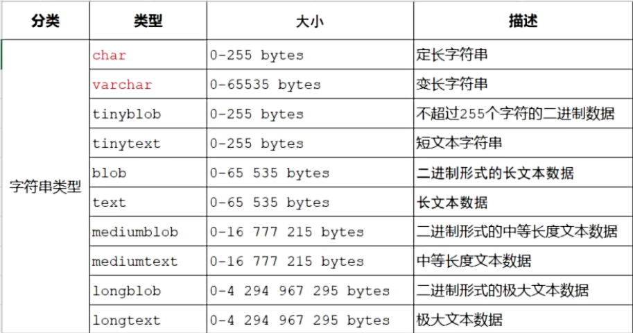
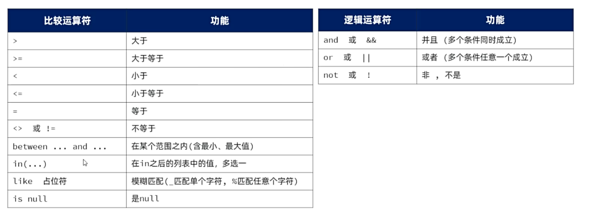

分类：

| 分类 | 用途         | 具体实现功能                           |
| ---- | ------------ | -------------------------------------- |
| DDL  | 数据定义语言 | 用于定义数据库对象（数据库，表，字段） |
| DML  | 数据操作语言 | 用于对数据库表数据进行增删查改         |
| DQL  | 数据查询语言 | 用于查询数据库中表的记录               |
| DCL  | 数据控制语言 | 用于创建数据库用户、控制数据库访问权限 |

**约束**:

| 约束     | 描述                                             | 关键字        |
| -------- | ------------------------------------------------ | ------------- |
| 非空约束 | 限制字段值不能为null                             | `not null`    |
| 唯一约束 | 保证字段的数据唯一                               | `unique`      |
| 主键约束 | 主键是一行数据的唯一标识，非空且唯一             | `primary key` |
| 默认约束 | 若未规定该字段值，采用默认值                     | `default`     |
| 外键约束 | 让两张表的数据建立连接，保证数据的一致性和完整性 | `foreign key` |

**数据类型**：
数值类型：


字符串类型：


日期时间类型：


## DDL

database等效于schema

### 库操作

- 查询所有数据库`show databases;`
- 查询当前数据库`select database();`
- 使用/切换数据库`use 数据库名;`
- 创建数据库`create database [if not exists] 数据库名 [default charset utf8mb4];`
- 删除数据库`drop database [if exists] 数据库名;`

### 表操作

创建表：

```sql
create  table tablename(
 字段1 字段类型 [约束] [conmment 字段1注释],
 字段2 字段类型 [约束] [conmment 字段2注释]
)[comment 表注释];
```

> ```sql
> create table user(
>        id int primary key auto_increment comment '用户id(唯一自动增长)',
>        username varchar(20) not null unique comment '用户名（非空唯一）',
>        password varchar(20) not null comment '密码(非空)',
>        name varchar(20)  not null comment '姓名(非空)',
>        age int not null comment '年龄（非空）',
>        gender varchar(1) default '男' comment '性别(默认为男)'
> )comment '用户表';
> ```

查询：

- 查询当前数据库的所有表`show tables;`
- 查询表结构`desc 表名;`
- 查询建表语句`show create table 表名;`

修改：

- 添加字段`alter table 表名 add 字段名 类型(长度) [comment 注释] [约束];`
- 修改字段类型`alter table 表名 modify 字段名 新数据类型(长度);`
- 修改字段名与字段类型`alter table 表名 change 旧字段名 新字段名 类型(长度) [comment 注释] [约束]`
- 删除字段`alter table 表名 drop column 字段名;`
- 修改表名`alter table 表名 rename to 新表名;`

删除：删除表`drop table [if exists] 表名;`

## DML

### 添加数据

- 指定字段添加数据`insert into 表名(字段名1,字段名2) values (值1,值2);`
- 全部字段添加数据`insert into 表名 values (值1,值2,...);`
- 批量添加数据（指定字段）`insert into 表名 (字段名1,字段名2) values (值1,值2),(值1,值2);`
- 批量添加数据（全部字段）`insert into 表名 values (值1,值2,...) (值1,值2,...);`

### 修改数据

`update 表名 set 字段名1 = 值1 , 字段名2 = 值2 , ... [where 条件];`

### 删除数据

`delete from 表名 [where 条件];`

## DQL

### 基本查询

- 查询多个字段：`select 字段1,字段2,字段3 form 表名;`
- 查询所有字段：`select * from 表名;`
- 为查询字段设置别名：`select 字段1 [as 别名1],字段2 [as 别名2] from 表名;`
- 去除重复记录：`select distinct 字段列表 from 表名;`

### 条件查询

`select 字段列表 from 表名 where 条件列表;`

SQL 条件运算符：



例：`select * from user where job is not null`

`select * from user where name like '李_'`；姓名为李x的数据

`select * form user where name like '%二%'`姓名中包含二的数据

### 分组查询

`select 字段列表 from 表名 [where 条件列表] group by 分组字段名 [having 分组后过滤条件];`

> where是分组前进行过滤，不满足where条件不参与分组，而having是分组之后对结果进行过滤

#### 聚合函数

| 函数  | 功能     |
| ----- | -------- |
| count | 统计数量 |
| max   | 最大值   |
| min   | 最小值   |
| avg   | 平均值   |
| sum   | 求和     |

- 统计该表数据总数`select count(*) from emp;`如果统计具体的字段数，值为`null`不参与统计
- 求一个字段的平均值 `select avg(sorce) from emp;`
- 求一个字段的最小值`select min(sorce) from emp;`
- 求一个字段中的最大值`select max(sorce) from emp;`
- 求一个字段的总和`select sum(sorece) from emp;`

`select gender from emp group by gender`进行分组操作后不要使用`select *`使用分组字段+聚合函数

`select job.count(*) from emp where data <= '2015-01-01' group by job having count(*) >=2;`挑选入职日期小于等于2015-01-01,筛选职位人数>2的职位

### 排序查询

`select 字段列表 from 表名 [where 条件列表] [group by 分组字段名 having 分组后过滤条件] order by 排序字段 排序方式;`

升序(asc) ,降序(desc),默认升序

`select * from emp where data <= '2015-01-01' order by data desc`

`select * from emp where data <= '2015-01-01' order by data, update desc;`

### 分页查询

`select 字段 from 表名 [where 条件] [group by 分组字段 having 过滤条件] [order by 排序字段] limit 起始索引，查询纪录数;`

- 起始索引从0开始
- 分页查询是数据库的方言，不听数据库有不同的实现，MYSQL种是LIMIT
- 如果起始索引为0，每页展示10条数据`limit 0,10`起始索引可以省略，简写为`limit 10`

`select * from emp limit 0,5;`查询数据，每页展示五条数据

`select * from emp limit 5,10;`查询第二页数据，每页展示五条数据
$起始索引=（页码-1）*每页展示记录数$
