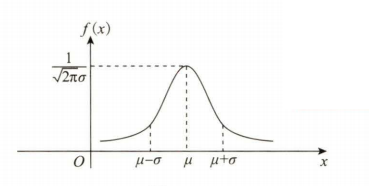
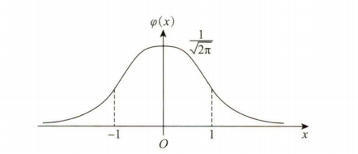

## 知识框架

## 随机变量及其分布函数的概念、性质及应用

### 随机变量

&nbsp;&nbsp;&nbsp;&nbsp;其值会随机而定的变量，一般用大写字母表示

### 分布函数

&nbsp;&nbsp;&nbsp;&nbsp;设$X$是随机变量，$x$是任意实数，称$F(x)=P(X\leq x)(x\in R)$为随机变量X的分布函数，或称$X$服从F(x)分布，记为$X\sim F(x)$。

性质（充要条件，三条同时满足）：单调不减，右连续，负无穷0正无穷1

1. F(x)是x的单调不减函数，即对任意实数$x_1<x_2$，都有$F(x_1)\leq F(x_2)$
2. F(x)是x的右连续函数，函数在某一点的值等于从右侧逼近该点时的极限值,即对任意$X_0\in R$，有
   $$\lim_{x \to x_{0}^{+}} F(x) = F(x_0+0)=F(x_0)$$
3. x趋于负无穷时为0，x趋于正无穷时为1
   $$F(-\infty) = \lim_{x \to -\infty} F(x) = 0 \quad F(+\infty) = \lim_{x \to +\infty} F(x) = 1$$

### 分布函数应用

$$P(X \leq a) = F(a);$$

$$P(X < a) = F(a - 0);$$

$$P(X = a) = F(a) - F(a - 0);$$

$$P(a < X < b) = F(b - 0) - F(a);$$

$$P(a \leq X < b) = F(b - 0) - F(a - 0);$$

$$P(a < X \leq b) = F(b) - F(a);$$

$$P(a \leq X \leq b) = F(b) - F(a - 0).$$

## 常见两类随机变量

### 离散型随机变量

&nbsp;&nbsp;&nbsp;&nbsp;随机变量X只可能取有限个或可列无限个值$x_1,x_2,...,$（离散的点）则称X为离散型随机变量，称$P(X=x_i)=p_i,i=1,2,...$为X的分布列、分布律或概率分布，记为$X\sim p_i$。

其充要条件为(离散的点)：
$$
p_i \geq 0, 且 \sum_{i=1}^{n} p_i = 1
$$

$X$ 的分布函数：
$$
F(x) = P(X \leq x) = \sum_{x_i \leq x} P(X = x_i)
$$
点区间：
$$
P(X = x_i) = P(X \leq x_i) - P(X < x_i) = F(x_i) - F(x_i - 0)
$$

并且对实数轴上的任一集合B，有
$$P(X\in B)=\sum_{x_i \in B}P(X=x_i)$$
分布区间：
$$P(a<X\leq b)=P(X\leq b)-P(X\leq a)=F(b)-F(a)$$

### 连续型随机变量（d(分布函数)=概率密度dx）

&nbsp;&nbsp;&nbsp;&nbsp;若X的分布函数可表示为
$$\int_{-\infty}^{x}f(t)dt(x\in R)$$
&nbsp;&nbsp;&nbsp;&nbsp;其中f(x)是非负可积函数，则称X为连续型随机变量，称f(x)为X的**概率密度函数**，简称**概率密度**，即为$X\sim f(x)$
充要条件(归一性)：
$$f(x)\geq 0\quad\int_{-\infty}^{+\infty}f(x)dx=1$$
注：在保证非负的条件下，改变f(x)有限个点的值，f(x)仍然是概率密度
&nbsp;&nbsp;&nbsp;&nbsp;(连续性中点概率为0)对任意实数c，有$P(X=c)=0$;（区间概率）对实数轴上任一集合B，有$P(X\in B)=\int_{B}f(x) \,dx$
特别的：
$$P(a<X<b)=P(a\leq X <b)=P(a<X\leq b)=P(a\leq X\leq b)=\int_{a}^bf(x)dx=F(b)-F(a)$$

## 常见随机变量分布模型

### 离散型

- 零一分布$X\sim B(1,p)$：$P(X=k)=p^k(1-p)^{1-k}$

- 二项分布$X\sim B(n,p)$：$P(X=k)=C_n^kp^k(1-p)^{n-k}(k=0,1,...;0<p<1)$

- 泊松分布$P(\lambda)$：$P(X=k)=\frac{\lambda^k}{k!}e^{-\lambda}(k=0,1,...;\lambda>0)$,X服从参数为$\lambda$的泊松分布，记为$X\sim P(\lambda)$
> 泊松定理：
> &nbsp;&nbsp;&nbsp;&nbsp;若X~B(n,p)，当n很大，p很小，$\lambda=np$适中是，二项分布可用泊松分布近似表示，即
> $$C_n^kp^k(1-p)^{n-k}\approx \frac{\lambda^k}{k!}e^{-\lambda}$$
> &nbsp;&nbsp;&nbsp;&nbsp;一般的，当$n\leq 20,p\geq 0.05$时，用泊松近似公式逼近二项分布效果比较好，特别当$n\leq 100,np\geq 10$时，效果更佳。

- 几何分布$G(p)(Ber-E_{\infty})$:$P(X=k)=(1-p)^{k-1}p(k=1,2,...;0<p<1)$,X服从几何分布，记为$X\sim G(p)$

- 超几何分布$H(n,N,M)$:$P(X=k)=\frac{C_M^kC_{N-M}^{n-k}}{C_N^n}(max(0,n-N+M)\geq k \geq min(M,n);M,N,n为正整数且M\leq N,n\leq N,k为整数)$，X服从超几何分布,记为$X\sim H(n,N,M)$

### 连续型

- 均匀分布$U(a,b)$:

&nbsp;&nbsp;&nbsp;&nbsp;则称$X$在区间$(a,b)$上服从均匀分布，记为$X\sim U(a,b)$

- 指数分布$E(\lambda)$:

&nbsp;&nbsp;&nbsp;&nbsp;则称$X$服从参数为$\lambda$的指数分布，，记为$X\sim E(\lambda)$

> 其中$\lambda$为失效频率，$EX=\frac{1}{\lambda}$

- 正态分布$N(\mu,\sigma)$:
   X的概率密度为：$f(x) = \frac{1}{\sqrt{2\pi\sigma^2}}e^{-\frac{1}{2} {\frac{x - \mu}{\sigma}}^2}$
   &nbsp;&nbsp;&nbsp;&nbsp;其中$-\infty<\mu<+\infty,\sigma >0$则称$X$服从参数为$(\mu ,\sigma ^2)$的正态分布或称X为正态变量，记为$X\sim N(\mu ,\sigma ^2)$,f(x)的图像关于$x=\mu $对称，并取到最大值$\frac{1}{\sqrt{2\pi\sigma}}$

   标准正态分布：$\mu =0,\sigma =1$,此时函数图像关于y轴对称，，最大值为$\frac{1}{\sqrt{2\pi}}$

## 一维随机变量函数分布

设$X$为随机变量，函数$Y=g(X)$，则以随机变量$X$作为自变量的函数$Y=g(X)$也是随机变量，称为随机变量$X$的函数

### 离散型->离散型

离散型随机变量其函数也为离散型随机变量

### 连续型->连续性（或混合型）
