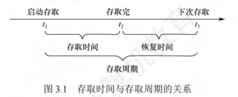
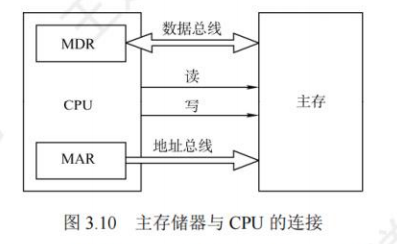
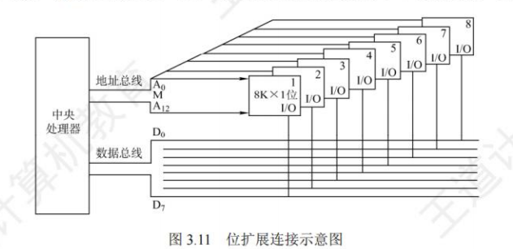
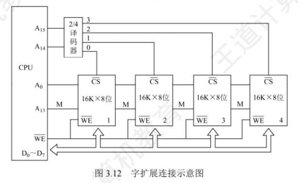
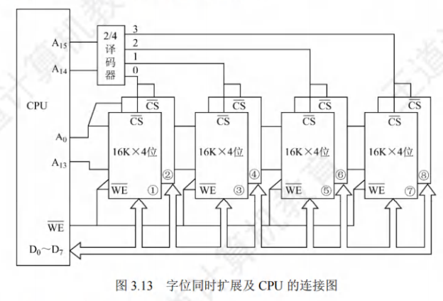
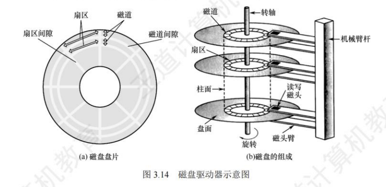
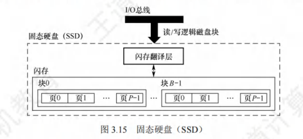
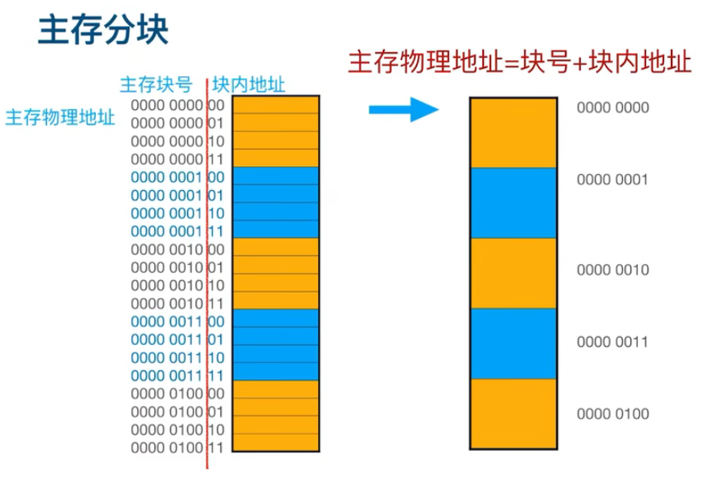

## 存储器概述

### 存储器的分类

按**计算机中的作用**分类：

1. 主存储器；简称主存，也称内存储器(内存)，用来存放计算机运行期间所需的程序和数据，CPU 可以直接随机地对其进行访问，也可以和高速缓冲存储器(Cache)及辅助存储器交换数据。其特点是容量较小、存取速度较快、每位的价格较高。
2. 辅助存储器：简称辅存，也称外存储器或外存，用来存放当前暂时不用的程序和数据，以及一些需要永久性保存的信息。辅存的内容需要调入主存后才能被 CPU 访问。其特点是容量大、存取速度较慢、单位成本低。
3. 高速缓冲存储器：简称 Cache，位于主存和 CPU 之间，用来存放当前 CPU 经常使用的指令和数据，以便 CPU 能高速地访问它们。Cache 的存取速度可与 CPU 的速度相匹配，但存储容量小、价格高。现代计算机通常将它们制作在 CPU 中。

按储存介质分：可分为磁表面存储器(磁盘、磁带)、磁芯存储器、半导体存储器(MOS型存储器、双极型存储器)和光存储器(光盘)。

按存取方式分：随机存储器（RAM），只读存储器（ROM），串行访问存储器

按信息的可保存性分：易失性存储器，非易失性存储器

### 存储器的性能指标

最求大容量，低成本，高速度

存储容量=存储字数$\times$字长,存储字数表示存储的地址空间大小，字长表示一次存取操作的数据量
单位成本：每位价格=总成本/总容量
存储速度：数据传输速率（每秒传送信息的位数）=数据的宽度/储存周期
    ① 存取时间($T_a$):存取时间是指从启动一次存储器操作到完成该操作所经历的时间，分为读出时间和写入时间。
    ②存取周期($T_m$):存取周期是指存储器进行一次完整的读1写操作所需的全部时间，即连续两次独立访问存储器操作(读或写操作)之间所需的最小时间间隔。
    ③ 主存带宽($B_m$):也称数据传输速率，表示每秒从主存进出信息的最大数量，单位为字/秒、字节/秒(B/s)或位/秒(b/s)。

存取时间不等于存取周期，通常存取周期大于存取时间。这是因为对任何一种存储器，在读/写操作之后，总要有一段恢复内部状态的复原时间。

### 多层级的存储系统

## 主存储器

SRAM静态随机存储器，DRAM动态随机存储器，都为易失性存储器。
储存元：存放二进制位的物理器件，位储存器的最基本的构件。
地址码相同的多个存储元构成一个存储单元。若干个存储单元的几何构成存储体

### SRAM芯片和DRAM芯片

**SRAM**
静态随机存储器(SRAM)的存储元是用双稳态触发器(六品体管 MOS)来记忆信息的，静态是指即使信息被读出后，它仍保持其原状态而不需要再生(非破坏性读出)。SRAM 的存取速度快，但集成度低，功耗较大，价格昂贵，一般用于高速缓冲存储器

**DRAM**
动态随机存储器(DRAM)是利用存储元电路中栅极电容上的电荷来存储信息的，DRAM 的基本存储元通常只使用一个品体管，所以它比SRAM 的密度要高很多。相对于 SRAM 来说，DRAM具有集成度高、位价低和功耗低等优点，但 DRAM 的存取速度比 SRAM 慢，且必须定时刷新和读后再生，一般用于大容量的主存系统。

DRAM 电容上的电荷一般只能维持1~2ms，读操作会使其状态发生改变(破坏性读出)，需读后再生，这也是称其为动态存储器的原因。对同一行进行相邻两次刷新的时间间隔称为刷新周期，通常取2ms。

1. 集中刷新：刷新时停止读写
2. 分散刷新：前半部分负责读写，后半部分负责刷新
3. 异步刷新：将刷新分散到每一行，一行读写一行刷新

注：
①刷新对 CPU 是透明的，即刷新不依赖于外部的访问；
②DRAM 的刷新单位是行，由芯片内部自行生成行地址；
③刷新操作类似于读操作，但又有所不同；
④刷新时不需要选片，即整个存储器中的所有芯片同时被刷新。

**SRAM和DRAM比较**

由于DRAM芯片容量大，地址位数多，为了减少地址引脚线，采用地址复用技术（DRAM分两次发送，长度相同）
引脚数=地址线减半+数据线不变+行通选（1）+列通选（1）+读写控制线（2）

### 只读存储器

特点：①结构简单，所以位密度比可读/写存储器的高。②具有非易失性，所以可靠性高。

类型：

1. 掩模式只读存储器（MROM）
    MROM 的内容由半导体制造厂按用户提出的要求在芯片的生产过程中直接写入，写入以后任何人都无法改变其内容。优点是可靠性高，集成度高，价格便宜:缺点是灵活性差。
2. 一次可编程只读存储器（PROM）
    PROM 是可以实现一次性编程的只读存储器。允许用户利用专门的设备(编程器)写入自己的程序，一旦写入，内容就无法改变。
3. 可擦除可编程只读存储器（EPROM）
    EPROM 不仅可以由用户利用编程器写入信息,而且可以对其内容进行多次改写。EPROM 虽然既可读又可写，但它不能取代 RAM，因为 EPROM 的编程次数有限，且写入时间过长。
4. Flash存储器
    Flash 存储器是在 EPROM 的基础上发展起来的，它兼有 ROM 和 RAM 的优点，可在不加电的情况下长期保存信息，又能在线进行快速擦除与重写。Flash 存储器既有 EPROM 价格便宜、集成度高的优点，又有 EPROM 电可擦除重写的特点，且擦除重写的速度快。
5. 固态硬盘
    基于闪存的固态硬盘是用固态电子存储芯片阵列制成的硬盘，由控制单元和存储单元(Flash芯片)组成。保留了 Flash 存储器长期保存信息、快速擦除与重写的特性。对比传统硬盘也具有读/写速度快、低功耗的特性，缺点是价格较高。

### 主存储器的基本组成

### 多模块存储器

多模块存储器是一种空间并行技术,利用多个结构完全相同的存储模块的并行工作来提高存储器的吞吐率。常用的有单体多字存储器和多体低位交叉存储器。

1. 单体多字存储器
    在单体多字系统中，每个存储单元存储 m个字，总线宽度也为 m个字，一次并行读出 m个字。在一个存取周期内，从同一地址取出m条指令，然后将指令逐条送至 CPU 执行，即每隔 1/m存取周期，CPU 向主存取一条指令。这显然提高了单体存储器的工作速度。
    缺点:
    只有指令和数据在主存中连续存放时，这种方法才能有效提升存取速度。一旦遇到转移指令，或操作数不能连续存放时，这种方法的提升效果就不明显。
2. 多体并行存储器
    多体并行存储器由多体模块组成。每个模块都有相同的容量和存取速度，各模块都有独立的读/写控制电路、地址寄存器和数据寄存器。它们既能并行工作，又能交叉工作。

  > 高位交叉编址（顺序方式）
  > 低位交叉编址（交叉方式）

## 主存储器与CPU的链接

### 链接原理

1)主存储器通过数据总线、地址总线和控制总线与CPU连接。
2)数据总线的位数与工作频率的乘积正比于数据传输速率。
3)地址总线的位数决定了可寻址的最大内存空间。
4)控制总线(读/写)指出总线周期的类型和本次输入/输出操作完成的时刻。

### 主存容量扩展

第一个数字为地址值，因此地址线即为log(n),第二个为数据线，几位即为有几条数据线。

**位扩展法**
添加位数，地址线与系统总线并联，一片8K*8位芯片=8片8K*1位的芯片

**字扩展法**
对存储字数量进行扩展，数据线与系统总线并联，16K*8位的存储器=2片8K*8位的存储器
例：4片16K*8位的芯片字扩展后位64K*8位的地址分配：
第一片，最低地址:0000000000000000:最高地址:0011111111111111(16位)
第二片，最低地址:0100000000000000:最高地址:0111111111111111
第三片，最低地址:1000000000000000:最高地址:1011111111111111
第四片，最低地址:1100000000000000:最高地址:1111111111111111

**字位同时扩展法**
同时进行字扩展与位扩展

### 存储芯片的地址分配和片选（未）

CPU要实现对存储单元的访问，首先要选择存储芯片，即进行片选:然后在选定的芯片中选择具体的存储单元，以进行数据的读/写，即进行字选。

线选法

译码片选法

## 外部存储器

### 磁盘存储器（详情见操作系统）

优点：
&nbsp;&nbsp;&nbsp;&nbsp;①存储容量大，位价格低；
&nbsp;&nbsp;&nbsp;&nbsp;②记录介质可重复使用；
&nbsp;&nbsp;&nbsp;&nbsp;③记录信息可长期保存而不丢失，甚至可脱机存档；
&nbsp;&nbsp;&nbsp;&nbsp;④非破坏性读出，读出时不需要再生。
缺点:存取速度慢，机械结构复杂，对工作环境要求较高。

磁盘存储器：
由磁盘驱动器、磁盘控制器和盘片组成

&nbsp;&nbsp;&nbsp;&nbsp;一个磁盘含有若干记录面，每个记录面划分为若干圆形的磁道，而每条磁道又划分为若干扇区，扇区(也称块)是磁盘读/写的最小单位，即盘按块存取。

- 磁头数(Heads)：即记录面数，表示磁盘共有多少个磁头，磁头用于读取/写入盘片上记录面的信息，一个记录面对应一个磁头。
- 柱面数(Cylinders)：表示磁盘每面盘片上有多少条磁道。在一个盘组中，不同记录面的相同编号(位置)的诸磁道构成一个圆柱面。
- 扇区数(Sectors)：表示每条磁道上有多少个扇区。

> 相邻磁道及相邻扇区间通过一定的间隙分隔开，以避免精度错误。
> 由于扇区按固定圆心角度划分，因此位密度从最外道向里道增加，磁盘的存储能力受限于最内道的最大记录密度。

磁盘高速缓存(Disk Cache):
&nbsp;&nbsp;&nbsp;&nbsp;在内存中开辟一部分区域，用于缓冲将被送到磁盘上的数据。
&nbsp;&nbsp;&nbsp;&nbsp;优点:写磁盘时是按“簇”进行的，可以避免频繁地用小块数据写盘;有些中间结果数据在写回磁盘之前可被快速地再次使用。

磁记录原理：
原理:
&nbsp;&nbsp;&nbsp;&nbsp;磁头和磁性记录介质相对运动时，通过电磁转换完成读/写操作。
编码方法:
&nbsp;&nbsp;&nbsp;&nbsp;按某种方案(规律)，把一连串的二进制信息变换成存储介质磁层中一个磁化翻转状态的序列，并使读/写控制电路容易、可靠地实现转换。
磁记录方式:
&nbsp;&nbsp;&nbsp;&nbsp;通常采用调频制(FM)和改进型调频制(MFM)的记录方式。

**性能指标**：

1. 记录密度：
   &nbsp;&nbsp;&nbsp;&nbsp;记录密度是指盘片单位面积上记录的二进制信息量，通常以道密度、位密度和面密度表示。道密度是沿磁盘半径方向单位长度上的磁道数，位密度是磁道单位长度上能记录的二进制代码位数，面密度是位密度和道密度的乘积。
2. 磁盘的容量：
   &nbsp;&nbsp;&nbsp;&nbsp;磁盘容量有非格式化容量和格式化容量之分。&nbsp;&nbsp;&nbsp;&nbsp;非格式化容量是指磁记录表面可利用的磁化单元总数，非格式化容量=记录面数x柱面数x每条磁道的磁化单元数。
   &nbsp;&nbsp;&nbsp;&nbsp;格式化容量是指按照某种特定的记录格式所能存储信息的总量。格式化容量=记录面数x柱面数x每道扇区数x每个扇区的容量。格式化后的容量比非格式化容量要小。
3. 存取时间：
    &nbsp;&nbsp;&nbsp;&nbsp;由寻道时间(磁头移动到目的磁道的时间)、旋转延迟时间(磁头定位到要读1写扇区的时间)和传输时间(传输数据所花费的时间)三部分构成。
4. 数据传输速率：
   &nbsp;&nbsp;&nbsp;&nbsp;磁盘存储器在单位时间内向主机传送数据的字节数，假设磁盘转数为r转/秒，每条磁道容量为N字节，则数据传输速率为$D_r=rN$

磁盘地址：

磁盘列阵：

### 固态硬盘

基于闪存技术的存储器，由半导体存储器构成，没有移动的部件，一个SSD由一个或多个闪存芯片和闪存翻译层组成。

优点：
&nbsp;&nbsp;&nbsp;&nbsp;①随机访问时间远快于机械磁盘；
&nbsp;&nbsp;&nbsp;&nbsp;②没有机械噪声和振动；
&nbsp;&nbsp;&nbsp;&nbsp;③能耗更低，抗震性好，安全性高
缺点:容易磨损导致损坏

## 高速缓冲存储器

### 程序访问的局部性原理

&nbsp;&nbsp;&nbsp;&nbsp;程序访问的局部性原理包括时间局部性和空间局部性，Cache的分块打包正是运用了局部性原理
&nbsp;&nbsp;&nbsp;&nbsp;时间局部性：是指最近的未来要用到的信息，很可能是现在正在使用的信息；
&nbsp;&nbsp;&nbsp;&nbsp;空间局部性：是指最近的未来要用到的信息，很可能与现在正在使用的信息在存储空间上是邻近的；

### Cache的基本工作原理

&nbsp;&nbsp;&nbsp;&nbsp;将主存物理地址分为块号和块内地址，CPU与Cache（或主存）间信息交互的单位是字，而Cache与主存直接的交互是块

性能分析：
$$Cache\text{命中率}=\frac{Cashe\text{的总命中次数}}{Cache的总命中次数+访问主存的总次数}$$

$$
系统平均访问时间 =
\text{Cache命中的概率} \times \text{Cache命中所需要花费的时间} + \\
\text{缺失的概率} \times \text{总线命中所需花费的时间}
$$

$$性能效率=\frac{全部访问Cache的时间}{系统平均访问时间}$$

### Cache和主存的映射方式

题目未说明时，默认为一字节。1B=8bits

直接映射
&nbsp;&nbsp;&nbsp;&nbsp;主存物理地址=标记+Cache行号+块内地址
一路组相联，一个块为一组，组的位置为固定的。

全相联映射
&nbsp;&nbsp;&nbsp;&nbsp;主存物理地址=标记+块内地址
随便映射。

组相联映射
&nbsp;&nbsp;&nbsp;&nbsp;主存物理地址=标记+组号+块内地址
n路组相联，n个块为一组，块在组里的位置可以改变，整个组的位置固定。

### Cache中主存块的替换算法（未）

### Cache的一致性问题

全写法：当CPU对Cache写命中时，必须把数据同时写入Cache和主存。
回写法：当CPU对Cache写命中时，只把数据写入Cache，而不立即写入主存，只有当此块被替换出时才写回主存。

## 虚拟存储器

### 虚拟存储器基本概念

&nbsp;&nbsp;&nbsp;&nbsp;将主存或辅存的地址空间进行统一编址，形成一个庞大的地址空间，在这个空间内，用户可以自由编程，不必在乎实际主存容量和程序在主存中实际的存放位置。
&nbsp;&nbsp;&nbsp;&nbsp;用户编程允许设计的地址称为虚地址或逻辑地址，虚地址对应的存储空间称为虚拟空间或程序空间。

### 页式虚拟存储器

### 段式虚拟存储器

### 段页式虚拟存储器

### 虚拟存储器与Cache的比较
