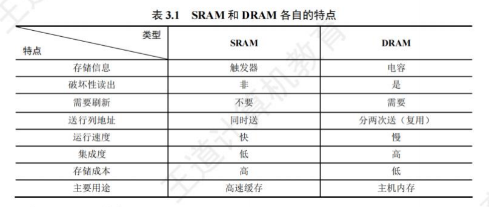

## 存储器概述

### 存储器的分类

按**计算机中的作用**分类：

1. 主存储器；简称主存，也称内存储器(内存)，用来存放计算机运行期间所需的程序和数据，CPU 可以直接随机地对其进行访问，也可以和高速缓冲存储器(Cache)及辅助存储器交换数据。其特点是容量较小、存取速度较快、每位的价格较高。
2. 辅助存储器：简称辅存，也称外存储器或外存，用来存放当前暂时不用的程序和数据，以及一些需要永久性保存的信息。辅存的内容需要调入主存后才能被 CPU 访问。其特点是容量大、存取速度较慢、单位成本低。
3. 高速缓冲存储器：简称 Cache，位于主存和 CPU 之间，用来存放当前 CPU 经常使用的指令和数据，以便 CPU 能高速地访问它们。Cache 的存取速度可与 CPU 的速度相匹配，但存储容量小、价格高。现代计算机通常将它们制作在 CPU 中。

按储存介质分：可分为磁表面存储器(磁盘、磁带)、磁芯存储器、半导体存储器(MOS型存储器、双极型存储器)和光存储器(光盘)。

按存取方式分：随机存储器（RAM），只读存储器（ROM），串行访问存储器

按信息的可保存性分：易失性存储器，非易失性存储器

### 存储器的性能指标

最求大容量，低成本，高速度

存储容量=存储字数$&times;$字长 存储字数表示存储的地址空间大小，字长表示一次存取操作的数据量
单位成本：每位加个=总成本/总容量
存储速度：数据传输速率（每秒传送信息的位数）=数据的宽度/储存周期
    ① 存取时间($T_a$):存取时间是指从启动一次存储器操作到完成该操作所经历的时间，分为读出时间和写入时间。
    ②存取周期($T_m$):存取周期是指存储器进行一次完整的读1写操作所需的全部时间，即连续两次独立访问存储器操作(读或写操作)之间所需的最小时间间隔。
    ③ 主存带宽($B_m$):也称数据传输速率，表示每秒从主存进出信息的最大数量，单位为字/秒、字节/秒(B/s)或位/秒(b/s)。

存取时间不等于存取周期，通常存取周期大于存取时间。这是因为对任何一种存储器，在读/写操作之后，总要有一段恢复内部状态的复原时间。

### 多层级的存储系统

## 主存储器

SRAM静态随机存储器，DRAM动态随机存储器，都为易失性存储器。
储存元：存放二进制位的物理器件，位储存器的最基本的构件。
地址码相同的多个存储元构成一个存储单元。若干个存储单元的几何构成存储体

### SRAM芯片和DRAM芯片

**SRAM**

静态随机存储器(SRAM)的存储元是用双稳态触发器(六品体管 MOS)来记忆信息的，静态是指即使信息被读出后，它仍保持其原状态而不需要再生(非破坏性读出)。SRAM 的存取速度快，但集成度低，功耗较大，价格昂贵，一般用于高速缓冲存储器

**DRAM**

动态随机存储器(DRAM)是利用存储元电路中栅极电容上的电荷来存储信息的，DRAM 的基本存储元通常只使用一个品体管，所以它比SRAM 的密度要高很多。相对于 SRAM 来说，DRAM具有集成度高、位价低和功耗低等优点，但 DRAM 的存取速度比 SRAM 慢，且必须定时刷新和读后再生，一般用于大容量的主存系统。

DRAM 电容上的电荷一般只能维持1~2ms，读操作会使其状态发生改变(破坏性读出)，需读后再生，这也是称其为动态存储器的原因。对同一行进行相邻两次刷新的时间间隔称为刷新周期，通常取2ms。

1. 集中刷新：刷新时停止读写
2. 分散刷新：前半部分负责读写，后半部分负责刷新
3. 异步刷新：将刷新分散到每一行，一行读写一行刷新

注：
①刷新对 CPU 是透明的，即刷新不依赖于外部的访问；
②DRAM 的刷新单位是行，由芯片内部自行生成行地址；
③刷新操作类似于读操作，但又有所不同；
④刷新时不需要选片，即整个存储器中的所有芯片同时被刷新。

**SRAM和DRAM比较**

### 只读存储器

特点：①结构简单，所以位密度比可读/写存储器的高。②具有非易失性，所以可靠性高。

类型：

1. 掩模式只读存储器（MROM）
  MROM 的内容由半导体制造厂按用户提出的要求在芯片的生产过程中直接写入，写入以后任何人都无法改变其内容。优点是可靠性高，集成度高，价格便宜:缺点是灵活性差。
2. 一次可编程只读存储器（PROM）
  PROM 是可以实现一次性编程的只读存储器。允许用户利用专门的设备(编程器)写入自己的程序，一旦写入，内容就无法改变。
3. 可擦除可编程只读存储器（EPROM）
  EPROM 不仅可以由用户利用编程器写入信息,而且可以对其内容进行多次改写。EPROM 虽然既可读又可写，但它不能取代 RAM，因为 EPROM 的编程次数有限，且写入时间过长。
4. Flash存储器
  Flash 存储器是在 EPROM 的基础上发展起来的，它兼有 ROM 和 RAM 的优点，可在不加电的情况下长期保存信息，又能在线进行快速擦除与重写。Flash 存储器既有 EPROM 价格便宜、集成度高的优点，又有 EPROM 电可擦除重写的特点，且擦除重写的速度快。
5. 固态硬盘
  基于闪存的固态硬盘是用固态电子存储芯片阵列制成的硬盘，由控制单元和存储单元(Flash芯片)组成。保留了 Flash 存储器长期保存信息、快速擦除与重写的特性。对比传统硬盘也具有读/写速度快、低功耗的特性，缺点是价格较高。
  
### 主存储器的基本组成

### 多模块存储器

多模块存储器是一种空间并行技术,利用多个结构完全相同的存储模块的并行工作来提高存储器的吞吐率。常用的有单体多字存储器和多体低位交叉存储器。

1. 单体多字存储器
  在单体多字系统中，每个存储单元存储 m个字，总线宽度也为 m个字，一次并行读出 m个字。在一个存取周期内，从同一地址取出m条指令，然后将指令逐条送至 CPU 执行，即每隔 1/m存取周期，CPU 向主存取一条指令。这显然提高了单体存储器的工作速度。
  缺点:
  只有指令和数据在主存中连续存放时，这种方法才能有效提升存取速度。一旦遇到转移指令，或操作数不能连续存放时，这种方法的提升效果就不明显。
2. 多体并行存储器
  多体并行存储器由多体模块组成。每个模块都有相同的容量和存取速度，各模块都有独立的读/写控制电路、地址寄存器和数据寄存器。它们既能并行工作，又能交叉工作。

  > 高位交叉编址（顺序方式）
  > 低位交叉编址（交叉方式）
