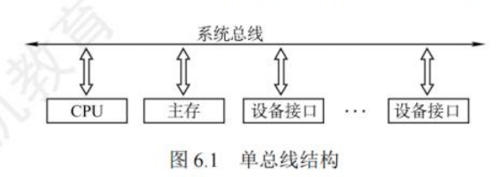
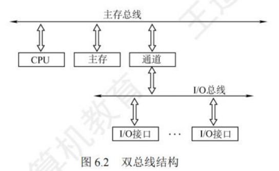
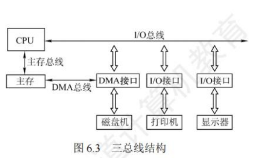

## 总线概述

### 总线基本概念

总线：总线是一组能为多个部件分时和共享的公共信息传送线路。分时和共享是总线的两个特点。部件上传只能一个一个，部件接收可以多部件接收

### 总线的分类

按**功能**，连接部件不同：

1. 片内总线：芯片内部的总线，用于 CPU 芯片内部各寄存器之间及寄存器与 ALU 的连接
2. **系统总线**：计算机系统内各功能部件(CPU、主存、I/0接口)之间相互连接的总线。按系统总线传输信息内容的不同，又可分为3类:
   &nbsp;&nbsp;&nbsp;&nbsp;①数据总线（传数据）
   > 传输各功能部件之间的数据信息
   > 是双向传输线
   > 数据总线的位数与机器字⻓、存储字⻓有关

   &nbsp;&nbsp;&nbsp;&nbsp;②地址总线（传地址）
   > 传输主存和I/O设备接⼝电路的地址
   > 单向传输线
   > 地址总线的位数与主存地址空间的⼤⼩有关

   &nbsp;&nbsp;&nbsp;&nbsp;③控制总线（传指令）
   > 传输控制信息,包括控制命令和反馈信号

3. I/O总线：主要用于连接中低速的 I/0 设备，通过 I/0 接口与系统总线相连接，目的是将低速设备与高速总线分离，以提升总线的系统性能，常见的有**USB**、PCI总线。
4. 通信总线：计算机系统之间或计算机系统与其他系统(如远程通信设备、测试设备)之间传送信息的总线，通信总线也称外部总线。

按**时序控制方式**分：

1. 同步总线：总线上连接的部件或设备通过统一的时钟进行同步，在规定的时钟节拍内进行规定的总线操作，来完成部件或设备之间的信息传输。
2. 异步总线：总线上连接的部件或设备没有统一的时钟，而以信号握手的方式来协调各部件或设备之间的信息传输，总线操作时序不是固定的。

按**数据传输方式**分：

1. 串行总线：一条双向或两条单向传输的数据线
2. 并行总线：多条双向传输的数据线
3. 总线复用：不同信号在同一信号线上分时传输

> 数据总线双向传输
> 地址总线单向传输，CPU传送至内存或外设
> 控制总线单向传输，控制信息CPU发送至内存或外设，状态信息由内存或外设发送至CPU

USB(通用串行总线)的特点有:
①即插即用;
②热插拔;
③有很强的连接能力，采用菊花链形式将众多外设连接起来;
④有很好的可扩充性,一个 USB 控制器可扩充高达 127 个外部 USB设备;
⑤高速传输，速率可达 480Mb/s。

### 系统总线结构

单总线结构：

优点：结构简单，成本低，易于接入新的设备。
缺点：带宽低、负载重，多个部件只能争用唯一的总线，且不支持并发传送操作。

双总线结构：
一条是主存总线，用于在CPU、主存和通道之间传送数据;
另一条是IO总线，用于在多个外部设备与通道之间传送数据。

优点:将低速 IO设备从原单总线上分离出来，实现了存储器总线和 IO 总线分离。
缺点:需要增加通道等硬件设备。

三总线结构：
在计算机系统各部件之间采用3条各自独立的总线来构成信息通路，这三条总线分别为主存总线、I/O总线和直接内存访问(DMA)总线，

优点:提高了IO设备的性能，使其更快地响应命令，提高系统吞吐量。缺点:任意时刻只能使用一种总线，系统工作效率较低。

### 总线的性能指标

1. 总线时钟周期：即机器的时钟周期。指系统总线中时钟信号完成一次完整波形（从高电平到低电平，再回到高电平）的时间间隔。它定义了总线传输数据的基本节奏和频率。
2. 总线时钟频率：即机器的时钟频率，它为时钟周期的倒数。
3. 总线传输周期：指一次总线操作所需的时间，包括申请阶段、寻址阶段、传输阶段和结束阶段。总线传输周期通常由若干总线时钟周期构成。
4. 总线工作频率：总线上各种操作的频率，为总线周期的倒数。实际上指1秒内传送几次数据。若总线周期=N个时钟周期，则总线的工作频率= 时钟频率/N:此外，若一个时钟周期可以传送K次数据，则总线工作频率是总线时钟频率的K倍。
5. 总线宽度。总线宽度也称总线位宽，是总线上能够同时传输的数据位数，通常指数据总线的根数，如 32 根称为 32 位总线。
6. 总线带宽：单位时间内总线上最多可传输数据的位数，通常用每秒传送信息的字节数来衡量，单位可用字节/秒(B/s)表示。总线带宽=总线工作频率x(总线宽度/8)。
7. 总线复用。总线复用是指一种信号线在不同的时间传输不同的信息。例如，有些总线没有单独的地址线，地址信息通过数据线来传送，这种情况称为地址/数据线复用。因此可以使用较少的线传输更多的信息，从而节省空间和成本。
8. 信号线数。地址总线、数据总线和控制总线3种总线数的总和称为信号线数。

其中，总线最主要的性能指标为总线宽度、总线工作频率、总线带宽。
三者的关系:总线带宽=总线宽度x总线工作频率。

## 总线事务和定时

### 总线事务

1. 请求阶段：主设备(CPU或DMA)发出总线传输请求，并且获得总线控制权。
2. 仲裁阶段：总线仲裁机构决定将下一个传输周期的总线使用权授予某个申请者。
3. 寻址阶段：主设备通过总线给出要访问的从设备地址及有关命令，启动从模块。
4. 传输阶段：主模块和从模块进行数据交换，可单向或双向进行数据传送。
5. 释放阶段：主模块的有关信息均从系统总线上撤除，让出总线使用权。

总线上的数据传送方式分为非突发方式和突发方式两种。非突发传送方式在每个传送周期内都先传送地址，再传送数据，主、从设备之间通常每次只能传输一个字长的数据。

突发(猝发)传送方式能够进行连续成组数据的传送，其寻址阶段发送的是连续数据单元的首地址，在传输阶段传送多个连续单元的数据，每个时钟周期可以传送一个字长的信息，但是不释放总线，直到一组数据全部传送完毕后，再释放总线。

### 总线定时

总线定时是指总线在双方交换数据的过程中需要时间上配合关系的控制，这种控制称为总线定时，其实质是一种协议或规则，主要有同步、异步、半同步和分离式四种定时方式。

1. **同步定时**：
    &nbsp;&nbsp;&nbsp;&nbsp;指系统采用一个统一的时钟信号来协调发送和接收双方的传送定时关系。时钟产生相等的时间间隔，每个间隔构成一个总线周期。在一个总线周期中，发送方和接收方可以进行一次数据传送。因为采用统一的时钟，每个部件或设备发送或接收信息都在固定的总线传送周期中，一个总线的传送周期结束，下一个总线的传送周期开始。

    优点:
    &nbsp;&nbsp;&nbsp;&nbsp;传送速度快，具有较高的传输速率;总线控制逻辑简单。
    缺点:
    &nbsp;&nbsp;&nbsp;&nbsp;主从设备属于强制性同步;不能及时进行数据通信的有效性检验，可靠性较差。

    &nbsp;&nbsp;&nbsp;&nbsp;同步通信适用于总线长度较短及总线所接部件的存取时间比较接近的系统。同步串行通信方式是发送方时钟直接控制接收方时钟，使双方完全同步的一种逐位传输的通信方式。使用同步串行通信时，由于收发双方的时钟严格一致，因此仅在数据块的头尾处添加了开始和结束标记，传输效率较高，但实现的硬件设备也更复杂，所以较少采用。
2. **异步定时**：
    &nbsp;&nbsp;&nbsp;&nbsp;在异步定时方式中，没有统一的时钟，也没有固定的时间间隔，完全依靠传送双方相互制约的“握手”信号来实现定时控制。通常，主设备提出交换信息的“请求”信号，经接口传送到从设备：从设备接到主设备的请求后，通过接口向主设备发出“回答”信号。
    优点:
    &nbsp;&nbsp;&nbsp;&nbsp;总线周期长度可变，能保证两个工作速度相差很大的部件或设备之间可靠地进行信息交换，自动适应时间的配合。
    缺点:
    &nbsp;&nbsp;&nbsp;&nbsp;比同步控制方式稍复杂一些，速度比同步定时方式慢。

    不互锁方式：
        &nbsp;&nbsp;&nbsp;&nbsp;主设备发出“请求”信号后，不必等到接到从设备的“回答”信号，而是经过一段时间便撤销“请求”信号。而从设备在接到“请求”信号后，发出“回答”信号，并经过一段时间后自动撤销“回答”信号。
    半互锁方式：
        &nbsp;&nbsp;&nbsp;&nbsp;主设备发出“请求”信号后，必须在接到从设备的“回答”信号后，才撤销“请求”信号，有互锁的关系。而从设备在接到“请求”信号后，发出“回答”信号,但不必等待获知主设备的“请求”信号已经撤销，而是隔一段时间后自动撤销“回答”信号，不存在互锁关系。
    全互锁方式：
        &nbsp;&nbsp;&nbsp;&nbsp;主设备发出“请求”信号后，必须在从设备“回答”后才撤销“请求”信号:从设备发出“回答”信号后，必须在获知主设备“请求”信号已撤销后，再撤销其“回答”信号。
        
3. **半同步定时**：
   数据发出时间严格参照系统时钟的某个前沿开始，而接收方都采用系统时钟后燕时刻来进行判断识别；同时允许不同速度的设备和谐地工作
   优点：
   &nbsp;&nbsp;&nbsp;&nbsp;控制方式比异步定时简单，各模块在系统时钟的控制下同步工作。
   缺点：
    &nbsp;&nbsp;&nbsp;&nbsp;系统时钟的频率不能要求太高，因此系统工作的速度不快。
4. **分离式定时**
    讲总线事务分解为请求和应答两个子过程。请求过程中，主设备A通过总线向设备B发送命令、地址；应答过程中设备B通过总线向总设备A发送相应的数据。两个过程都只有单方向的信息流，每个设备都变为主设备。
    优点：
    &nbsp;&nbsp;&nbsp;&nbsp;在不传送数据时释放总线，使总线可接受其他设备的请求，不存在空闲等待时间；
    缺点：
    &nbsp;&nbsp;&nbsp;&nbsp;控制复杂，开销大。
| **同步定时/控制方式**                           | **异步定时/控制方式**                          |
|----------------------------------------------|----------------------------------------------|
| **定义**                                     | **定义**                                     |
| · 由统一时序控制的通信方式   · 同步通信采用公共时钟，有统一的时钟周期，同步时钟信号不由各设备提供   · 同步控制既可用于CPU控制，又可用于高速的外部设备控制 | · 没有统一的时钟；没有固定的时间间隔（不采用时钟信号，只采用握手）   · 完全依靠传送双方相互制约的“握手”信号来实现定时控制   · 传送操作是由双方按需求分配时间的   · 每次握手完成一次通信，但是一次通信往往交换多位数据 |
| **优点**                                     | **优点**                                     |
| · 传送速度快，具有较高的传输速率   · 总线控制逻辑简单   · 同步通信不需要应答信息且总线长度短   · 同步通信用一个公共的时钟信号进行同步   · 同步通信中，各部件的存取时间较接近 | · 总线周期长度可变   · 能保证两个工作速度相差很大的部件或设备之间可靠地进行信息交换   · 自动适应时间的配合 |
| **缺点**                                     | **缺点**                                     |
| · 主从设备属于强制性同步   · 不能及时进行数据信道的有效性验证   · 可靠性较差 | · 比同步稍复杂一些   · 速度比同步方式慢 |
| **适用场合**                                 | **适用场合**                                 |
| · 适用于总线长度较短及总线所接部件的存取时间比较接近的系统   · 采用同步控制也可以进行数据的传输，但不能发挥快速设备的高速性能 | · 主要用于在不同的设备间进行通信 |

