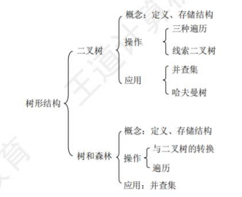
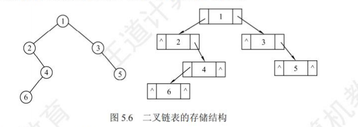
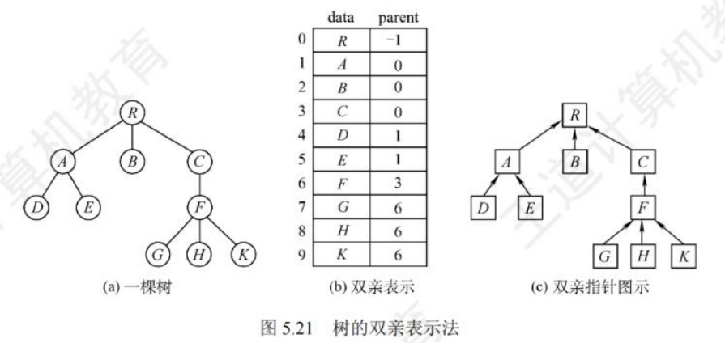
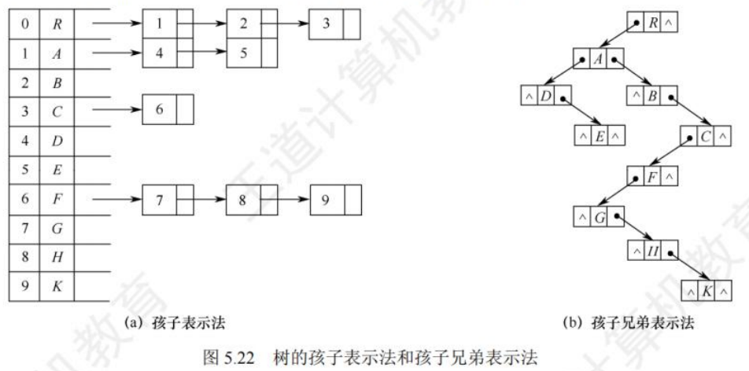
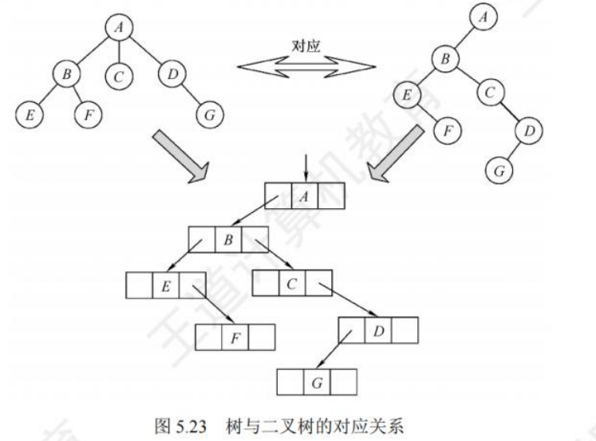
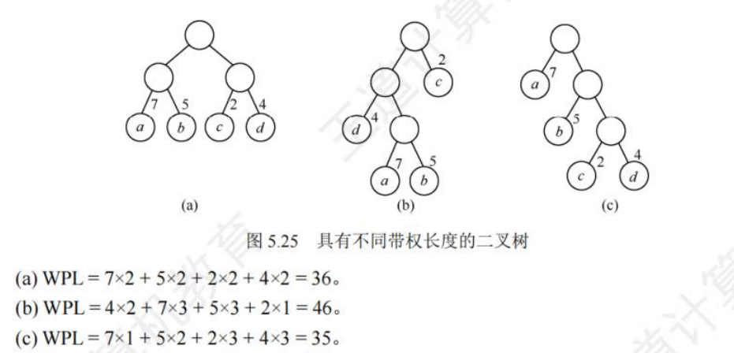

## 知识框架



## 树的基本概念

### 树的属性

在任意一棵非空树中应满足:
1)有且仅有一个特定的称为根的结点。
2)当n>1时，其余结点可分为m(m>0)个互不相交的有限集$T_1,T_2,\dots ,T_m$，其中每个集合本身又是一棵树，并且称为根的子树。

- 结点的度：一个结点的孩子的个数
- 树的度：树中结点的最大度数
- 分支结点：又称非终端结点，即度>0的结点
- 叶（子）结点：又称终端结点，即度为0的结点
- 树的高度：树中结点的最大层数
- 结点深度：结点所在的层数
- 结点高度：以该结点为根的子树的高度
- 有序树：树中结点的各子树从左到右
- 路径长度：路径上所经过的边的个数

森林：是$m(m\geq 0)$棵互不相交的树的集合。
> 把树的根结点删去就成了森林
> 给m棵独立的树加上一个结点，并把这m棵树作为该结点的子树，则森林就变成了树

### 树的性质

- 树的结点数n等于所有结点的度数之和加1。
- 度为m的树中第i层上至多有$m^{i-1}$个结点$(i\geq 1)$:1层1，2层吗，三层m*m
- 高度为h的m叉树至多有$(m^k-1)/(m-1)$个结点:$1+m+m^m+\dots+m^{h-1}=(m^k-1)/(m-1)$
- 度为 m、具有 n个结点的树的最小高度h为$\log_m{n(m-1)+1}$
- 度为 m、具有几个结点的树的最大高度h为n-m+1.

## 二叉树的概念

### 二叉树的主要特性

树的度$\leq 2$是一种特殊的有序树，颠倒左右子树是另一棵不同的二叉树

特殊的二叉树：

&nbsp;&nbsp;&nbsp;&nbsp;二叉排序树：左子树上所有结点的关键字均小于根结点的关键字;右子树上所有结点的关键字均大于根结点的关键字;左子树和右子树又各是一棵二叉排序树。
&nbsp;&nbsp;&nbsp;&nbsp;平衡二叉树：树中任意一个结点的左子树和右子树的高度之差的绝对值不超过 1。
&nbsp;&nbsp;&nbsp;&nbsp;正则二叉树：树中每个分支结点都有2个孩子，即树中只有度为0或2的结点

**二叉树的性质**：

- 非空二叉树上的叶结点数等于度为2的结点数加1。
- 非空二叉树的第k层最多有$2^{k-1}$个结点$(k\geq 1)$.
- 高度为h的二叉树至多有$2^h-1$个结点$(h\geq 1)$。
- 具有n个结点的完全二叉树的高度为$\log_2n-1$

### 存储结构

顺序存储


链式存储:



```cpp
typedef struct BiTNode{
    ElemeType data;
    struct BiTNode *lchilde,*rchild;
}BiTNode,*BiTree;//下面这两个可省，BiTree等价于BiTNode*
```

## 二叉树的遍历和线索二叉树

### 二叉树遍历

三种遍历见二叉树及其实现

层次遍历：
①首先将二叉树的根结点入队。
②若队列非空，则队头结点出队，访问该结点，若它有左孩子，则将其左孩子入队;若它有右孩子，则将其右孩子入队。
③重复②步，直至队列为空。

```cpp
void LevelOrder(BiNode *T)
{
    InitQueue(Q); // 初始化辅助队列
    BiTNode *p;
    EnQueue(Q, T); // 根节点入队
    while (!IsEmpty(Q))
    {
        DeQueue(Q, p); // 队首元素出队
        visit(p);      // 访问出队节点
        if (p->lchild != NULL)
            EnQueue(Q, p->lchild);
        if (p->rchild != NULL)
            EnQueue(Q, p->rchild);
    }
}
```

### 线索二叉树

&nbsp;&nbsp;&nbsp;&nbsp;遍历二叉树是以一定的规则将二叉树中的结点排列成一个线性序列，从而得到几种遍历序列，使得该序列中的每个结点(第一个和最后一个除外)都有一个直接前驱和直接后继。

&nbsp;&nbsp;&nbsp;&nbsp;规定:若无左子树，令 1child 指向其前驱结点;若无右子树，令 rchild 指向其后继结点。


&nbsp;&nbsp;&nbsp;&nbsp;前驱节点是某一节点在遍历顺序中的前一个节点,后继节点是某一节点在遍历顺序中的后一个节点。想要得到一个线索二叉树，需要对原二叉树进行线索化，根据遍历方式找到其前驱与后继节点。

存储结构：

```cpp
struct ThreadNode{
    Element data;
    ThreadNode *lchild, *rchild;
    int ltag, rtag;
}
```

&nbsp;&nbsp;&nbsp;&nbsp;以这种结点结构构成的二叉链表作为二叉树的存储结构，称为线索链表，其中指向结点前驱和后继的指针称为线索。加上线索的二叉树称为线索二叉树。

## 树、森林

### 树的存储结构

&nbsp;&nbsp;&nbsp;&nbsp;**双亲表示法**：采用一组连续空间来存储每个节点，同时在每个节点种增设一个伪指针，指示其双亲结点在数组中的位置。



```cpp
struct PTNode{//树结点定义
    ElemType data;
    int parent;//双亲位置
}
struct PTree{
    PTNode nodes[MAX_TREE_SIZE];//结点数组
    int r,n;//根的位置和结点数
};
```

&nbsp;&nbsp;&nbsp;&nbsp;**孩子表示法**：孩子表示法是将每个结点的孩子结点视为一个线性表，且以单链表作为存储结构，则n个结点就有n个孩子链表(叶结点的孩子链表为空表)。而n个头指针又组成一个线性表，为便于查找，可采用顺序存储结构。

> &nbsp;&nbsp;&nbsp;&nbsp;与双亲表示法相反，孩子表示法寻找孩子的操作非常方便，而寻找双亲的操作则需要遍历n个结点中孩子链表指针域所指向的"个孩子链表。



&nbsp;&nbsp;&nbsp;&nbsp;**孩子兄弟表示法**：又称为二叉树表示法，以二叉链表作为树的存储结构

```cpp
struct CSNode{
    ElemType data;
    struct CSNode *firstchild, *nextsibling;//第一个孩子和右兄弟指针
}
```

### 树、森林与二叉树的转换

**树转二叉树**：
&nbsp;&nbsp;&nbsp;&nbsp;①在兄弟结点之间加一连线；
&nbsp;&nbsp;&nbsp;&nbsp;②对每个结点，只保留它与第一个孩子的连线，而与其他孩子的连线全部抹掉；
&nbsp;&nbsp;&nbsp;&nbsp;③以树根为轴心，顺时针旋转 45°。


**森林转二叉树**：
&nbsp;&nbsp;&nbsp;&nbsp;①将森林中的每棵树转换成相应的二叉树；
&nbsp;&nbsp;&nbsp;&nbsp;②每棵树的根也可视为兄弟关系，在每棵树的根之间加一根连线:
&nbsp;&nbsp;&nbsp;&nbsp;③以第一棵树的根为轴心顺时针旋转 45°。

二叉树转森林：
&nbsp;&nbsp;&nbsp;&nbsp;若二叉树非空，则二叉树的根及其左子树为第一棵树的二叉树形式，所以将根的右链断开。二叉树根的右子树又可视为一个由除第一棵树外的森林转换后的二叉树，应用同样的方法，直到最后只剩一棵没有右子树的二叉树为止，最后将每棵二叉树依次转换成树，就得到了原森林，


### 树和森林的遍历

树的遍历：

①先根遍历：先访问根结点再访问子树。

②后根遍历，先访问子树再访问根。

森林的遍历：

①先序遍历森林：

- 先访问第一棵树的根结点
- 先序遍历第一棵树种根节点的子树森林
- 先序遍历除去第一棵树之后剩余的树构成的森林

②中序遍历森林

- 中序遍历森林中第一棵树的根结点的子树森林
- 访问第一棵树的根结点
- 中序遍历除去第一棵树之后剩余的树构成的森林

## 树与二叉树的应用

### 哈夫曼树和哈夫曼编码

- 路径：从树中一个结点到另一个结点之间的线
- 路径长度：路径上线的数目
- 结点的权：树中结点常常被赋予一个表示某种意义的数值
- 结点的带权路径长度：从树的根到一个结点的路径长度与该结点上权值的乘积


&nbsp;&nbsp;&nbsp;&nbsp;在含有n个带权叶结点的二叉树中,其中带权路径长度(WPL)最小的二叉树称为**哈夫曼树**也称**最优二叉树**。

哈夫曼树构造：

&nbsp;&nbsp;&nbsp;&nbsp;①将这n个结点分别作为n棵仅含一个结点的二叉树，构成森林F；
&nbsp;&nbsp;&nbsp;&nbsp;②构造一个新结点，从F中选取两棵根结点权值最小的树作为新结点的左、右子树，并且将新结点的权值置为左、右子树上根结点的权值之和。
&nbsp;&nbsp;&nbsp;&nbsp;③从F中删除刚才选出的两棵树，同时将新得到的树加入F中。
&nbsp;&nbsp;&nbsp;&nbsp;④重复步骤 ②和③，直至F中只剩下一棵树为止。


哈夫曼编码：

- 固定长度编码：对每个字符用相等长度的二进制位表示
- 可变长度编码：允许对不同字符用不等长的二进制位表示
- 前缀编码：没有一个编码是另一个编码的前缀

哈夫曼编码是一种非常有效的数据压缩编码，权值为该字符出现的次数，路径理解为编码，对于多次出现的字符，根据哈夫曼树可将其放在更上方的位置，使其的编码尽可能的简单，使得编写更加快捷的同时减少数据量。

### 并查集

- Initial(S)：将集合S中的每一个元素都初始化为只有一个单元数的子集合
- Union(S, Root1, Root2)：把集合S中的子集合 Root2并入子集合 Root1。要求 Root1和 Root2 互不相交，否则不执行合并。
- Find(S, x)：查找集合S中单元素x所在的子集合，并返回该子集合的根结点。

并查集的存储结构：

&nbsp;&nbsp;&nbsp;&nbsp;采用树的双亲表示作为并查集的存储结构，每个子集合以一棵树表示。所有表示子集合的树构成表示全集合的森林，存放在双亲表示数组内。通常用数组元素的下标代表元素名，用根结点的下标代表子集合名，根结点的双亲域为负数
