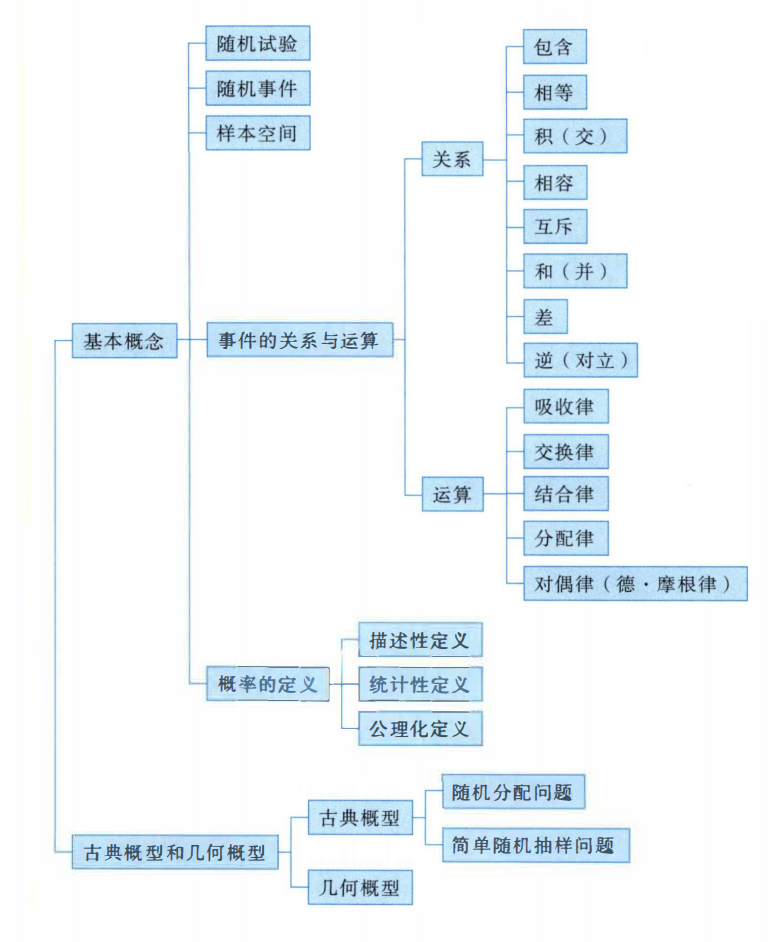

## 知识框架

## 基本概念

### 随机试验

随机试验条件：

1. 试验可以在相同的条件下重复进行;
2. 试验所有可能结果明确可知，且不止一个;
3. 每一次试验会出现哪一个结果，事先并不能确定

随机试验简称试验，用字母 $E_i$ 表示

### 随机事件

在一次试验中可能出现，也可能不出现的结果称为 **随机事件**，简称 **事件**，并用大写字母 A, B, C 等表示。将每次试验中一定发生的事件称为 **必然事件**，记为 $\Omega$。每次试验中一定不发生的事件称为 **不可能事件**，记为 ∅。

### 样本空间

随机试验的每一个可能结果称为**样本点**，记为 $\omega$。样本点的全体组成的集合称为**样本空间**（或**基本事件空间**），记为$\Omega $,即$\Omega = \{\omega\}$,由一个样本点构成的事件称为**基本事件**.随机事件A总是由若千个基本事件组成，即A是$\Omega$的子集。

### 事件关系与运算

关系：**对立一定互斥**

1. 包含
2. 相等
3. 和（并）：至少有一个发生
4. 积（相交）：两个同时发生
5. 相容：$AB≠ ∅$
6. 互斥（互不相容）：$AB= ∅$
7. 对立：$AB= ∅,A∪B=\Omega$
8. 差：$A-B$ A发生而B不发生
9. 逆：$B=\bar{A}$

&nbsp;&nbsp;&nbsp;&nbsp;完备事件组: 如果$\bigcup_{i=1}^{n} A_i = \Omega$(或$\bigcup_{i=1}^{\infty} A_i = \Omega$)且$A_i \cap A_j = ∅set(\text{对一切 } i \neq j;i, j = 1, 2, \dots, n(\dots)),$称有限(或可列)事件 \( A_1, A_2, \dots, A_n (\dots) \) 构成一个完备事件组。

运算：

1) 吸收律:
   若 A ⊆ B, 则 A ∪ B = B, A ∩ B = A。

2) 交换律:
   A ∪ B = B ∪ A, A ∩ B = B ∩ A。

3) 结合律:
   (A ∪ B) ∪ C = A ∪ (B ∪ C), (A ∩ B) ∩ C = A ∩ (B ∩ C)。

4) 分配律:
   A ∩ (B ∪ C) = (A ∩ B) ∪ (A ∩ C),
   A ∪ (B ∩ C) = (A ∪ B) ∩ (A ∪ C),
   A ∩ (B - C) = (A ∩ B) - (A ∩ C)。

5) 对偶律 (德·摩根律):
   A ∪ B = A̅ ∩ B̅,
   A ∩ B = A̅ ∪ B̅。

6) $A\bar{B}=A-AB=A-B$

注：

1. 事件运算顺序约定为先进行逆运算，然后进行交运算，最后进行并或差运算。
2. 事件的关系、运算与集合的关系、运算相当，且具有相同的运算法则，所以我们可以对比着理解记忆，并要学会用集合关系去考虑事件关系。

### 概率的定义

描述性定义：
&nbsp;&nbsp;&nbsp;&nbsp;通常将随机事件A发生的可能性大小的度量(非负值)称为事件A发生的概率，记为P(A)

统计性定义：
&nbsp;&nbsp;&nbsp;&nbsp;在相同条件下做重复试验，事件A出现的次数k和总的试验次数n之比$\frac{k}{n}$称为事件A在这n次试验中出现的频率.当试验次数n充分大时，频率将“稳定”于某常数p."越大，频率偏离这个常数p的可能性越小.这个常数p就称为事件A的概率。

公理化定义：
&nbsp;&nbsp;&nbsp;&nbsp;设随机试验的样本空间为 $\Omega$，如果对每一个事件 $A$ 都有一个确定的实数 \(P(A)\)，且事件函数 $P(\cdot)$ 满足：

1) 非负性：$P(A) \geq 0$；
2) 规范性：$P(\Omega) = 1$；
3) 可列可加性：对于任意可列的两两互不相容事件 $A_1, A_2, \dots, A_n, \dots$（即 $A_i \cap A_j = ∅$, $i \neq j$, $i, j = 1, 2, \dots$），有：

   $$
   P\left( \bigcup_{i=1}^{\infty} A_i \right) = \sum_{i=1}^{\infty} P(A_i),
   $$

则称 $P(\cdot)$ 为概率，$P(A)$ 为事件 $A$ 的概率。

## 古典概型和几何概型

### 古典概型

条件：

1. 只有有限个样本点(基本事件);
2. 每个样本点(基本事件)发生的可能性都一样。

如果古典概型的基本事件总数为n，事件A包含k个基本事件，也叫作有利于A的基本事件为k个则A的概率为
$$
P(A)=\frac{k}{n}=\frac{\text{事件A所含基本事件的个数}}{\text{基本事件总数}}
$$

题目：

1. 随机分配
2. 简单随机抽样（先后有放回，先后无放回，任取）

### 几何概型

条件：

1. 样本空间(基本事件空间)$\Omega$是一个可度量的有界区域;
2. 每个样本点(基本事件)发生的可能性都一样，即样本点落入$\Omega$的某一可度量的子区域S的可能性大小与S的几何度量成正比，而与S的位置及形状无关。

在几何概型随机试验中，如果$S_A$是样本空间$\Omega$的一个可度量的子区域，则事件A={样本点落入区域$S_A$}的概率为
$$
P(A)=\frac{S_A\text{的几何度量}}{\Omega的几何度量}
$$

### 区别

古典概型与几何概型的区别:基本事件有限、等可能发生的随机试验为古典概型;基本事件无限且具有几何度量、等可能发生的随机试验为几何概型。

## 概率的性质与公式

### 性质

有界性：对于任一事件A，有0≤P(A)≤1,且P(∅)=0,P(2)=1
> P(A)=0，不能断言A=∅;P(A)=1，不能断言A=$\Omega$.

单调性：$P(B-A)=P(B)-P(A),P(B)\geq P(A)$

### 公式

1. $P(A)+P(\bar{A})=1$
2. $P(A\cup B)=P(A)+P(B)-P(A\cap B)$
    > &nbsp;&nbsp;&nbsp;&nbsp;$P(A\cup B\cup C)=P(A)+P(B)+P(C)-P(A\cap B)-P(A\cap C)$
    > $-P(B\cap C)+P(A\cap B\cap C)$
3. $P(A-B)=P(A)-P(AB)=P(A\bar{B})$
4. 条件概率公式：$P(B|A)=\frac{P(AB)}{P(A)}$
5. 乘法公式：如果$P(A)>0$,则$P(AB)=P(A)P(B|A)$
6. 全概率公式 一个事件发生的概率=其他事件的条件下发生该事件的概率之和
7. 贝叶斯公式
$$P(A_j|B)=\frac{P(A_j)P(B|A_j)}{\sum_{i=1}^{n}P(A_i)P(B|A_i)}(j=1,2,...,n)$$

> tips：P(A ∪ B) = 1 不能推出 A ∪ B = 全集，且 P(A ∩ B) = P(A ∪ B) - P(A) - P(B) = 0 不能推出 A ∩ B = ∅

## 事件的独立性和独立重复试验

### 事件的独立性

P(AB)=P(A)P(B)

### 独立性的判定

1. $A$与$B$相互独立=$A$与$\bar{B}$相互独立=$\bar{A}$与$B$相互独立=$\bar{A}$与$\bar{B}$相互独立
2. 对独立事件组不含相同事件作运算，得到的新事件组仍独立，如A,B,C,D相互独立，则 AB与CD相互独立，A与BC-D相互独立.
3. 若P(A)=0或P(A)=1，则A与任意事件B相互独立

> 两两独立：当一组随机事件中任意两个事件是独立的时
> 相互独立：一组事件中，任意子集的事件组合都是独立的

### 独立试验序列概型与n重伯努利概型

独立试验序列概型：
&nbsp;&nbsp;&nbsp;&nbsp;独立试验序列概型指的是一系列相互独立的试验，每个试验可能有不同的结果，且各个试验之间没有相互影响。独立性意味着每个试验的结果不依赖于其他试验的结果。

- 试验可以有两种或多种不同的结果。
- 各个试验之间是相互独立的，也就是说一个试验的结果不会影响其他试验的结果。
- 适用于描述多个相互独立的随机事件。

n重伯努利概型：

- 每次试验只有A与$\bar{A}$两个结果;
- 每次试验A发生的概率p=P(A)不变:
- 试验独立重复进行n次.

&nbsp;&nbsp;&nbsp;&nbsp;在n重伯努利概型中，事件A发生k次(只管次数，不论位置)的概率为$C_n^kp^k(1-p)^{n-k}(k=0,1,...,n)$，且如果用X表示n重伯努利概型中事件A发生的次数，则X服从二项分布B(n，p).
